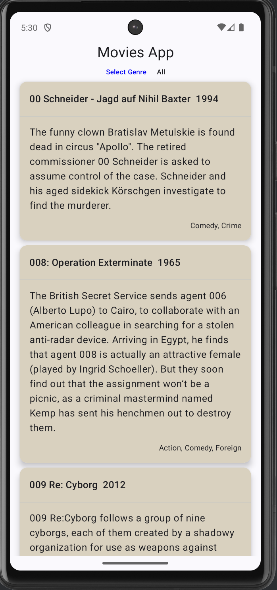
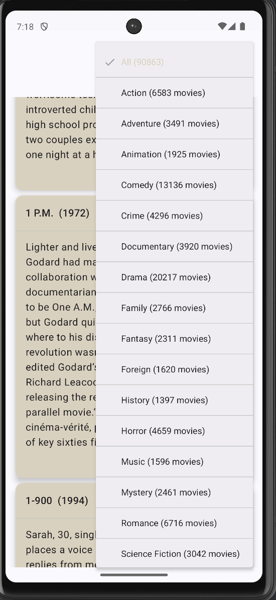

# 🎬 MoviesApp (Under progress)

MoviesApp is a sample Android application designed to showcase a modern, scalable, and maintainable Android architecture. It allows users to browse through a list of movies, filter them by genre, and view their details.

This project serves as a practical example of Clean Architecture principles combined with the latest Android Jetpack libraries and industry-best practices.

 

## ✨ Features

-   Browse an infinite-loading list of popular movies.
-   Filter movies by genre.
-   View movie details (description, release year, etc.).
-   Fully offline-capable (feature to be implemented).
-   Clean, intuitive, and responsive UI built with Jetpack Compose.

## 🛠️ Tech Stack & Architecture

This project follows the principles of **Clean Architecture** and **MVVM (Model-View-ViewModel)**. The architecture is divided into three primary layers: Domain, Data, and Presentation (UI).

-   **UI (Presentation) Layer**: Built with **Jetpack Compose** for a declarative and modern UI. Uses `ViewModel` to hold UI state and handle user events.
-   **Domain Layer**: The core business logic of the application. It is a pure Kotlin module with no Android dependencies, making it highly reusable and testable. It defines `UseCases` (e.g., `GetMovies`, `GetGenres`) that encapsulate specific business rules.
-   **Data Layer**: Manages the data sources. It implements the repository pattern to abstract data sources (network, local database) from the rest of the app.

### Undergoing activities:
This project is still undergoing activities, which is listed below
-   Add Compose UI tests.
-   Add Integration and END to END tests ( IMoviesRepository to create new fake repos)
-   Fix critical UI issues (Glitches, Dark mode issue, UI positioning)
-   Improving the Movie listing and Genre listing user interface
-   Improve pagination logic if needed (can use pagination library from Jetpack compose)
-   Needs to add More unit tests
-   CI 
-   Benchmarking

### Key Libraries Used:

-   **[Kotlin](https://kotlinlang.org/)**: First-party and recommended language for Android development.
-   **[Jetpack Compose](https://developer.android.com/jetpack/compose)**: Android's modern toolkit for building native UI.
-   **[Coroutines](https://kotlinlang.org/docs/coroutines-guide.html)** & **[Flow](https://kotlinlang.org/docs/flow.html)**: For managing background threads and handling asynchronous data streams.
-   **[ViewModel](https://developer.android.com/topic/libraries/architecture/viewmodel)**: To store and manage UI-related data in a lifecycle-conscious way.
-   **[Retrofit](https://square.github.io/retrofit/)**: A type-safe HTTP client for making network requests.
-   **[Room](https://developer.android.com/training/data-storage/room)**: A persistence library for local database storage (for offline support).
-   **[Dagger Hilt](https://developer.android.com/training/dependency-injection/hilt-android)**: For dependency injection.

### Testing Libraries:

-   **[JUnit4](https://junit.org/junit4/)**: The standard for unit testing in Java/Kotlin.
-   **[MockK](https://mockk.io/)**: An idiomatic mocking library for Kotlin.
-   **[Turbine](https://github.com/cashapp/turbine)**: A small testing library for Kotlin Flows.
-   **`kotlinx-coroutines-test`**: Provides testing utilities for coroutines, including `runTest` and `TestDispatcher`.

## 🚀 Getting Started

### Prerequisites

-   Android Studio Iguana | 2023.2.1 or higher.
-   JDK 17 or higher.

### Build Instructions

1.  **Clone the repository:**

    
